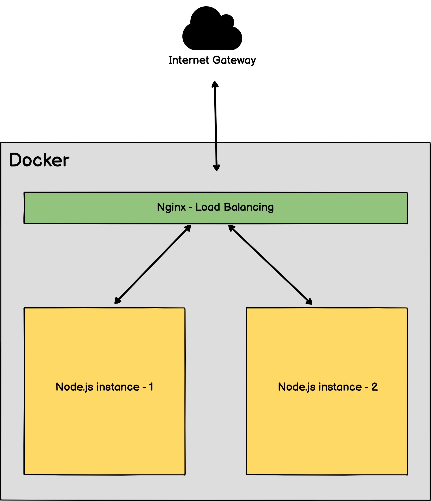

# How to Dockerize NodeJS app? (Full instructions with Typescript, Nginx and Docker Compose) Step-by-step guide.

In this video, I will show you and explain how to wrap a Node.js app into a set of containers and launch with Docker compose. I will automate a build with Dockerfile, launch 2 containers with the Node.app and Nginx as a Load balancer.

## Application Scheme:

## How to Run?

`docker compose up` Run

`docker compose up -d` Run on a server (detach mode - runs containers in the background)

## Updating:

`docker compose build` - Build the images, then:

`docker compose up -d` (on the server)

## If you want to rebuild images:

`docker compose up --build`

## Removing containers and network:

`docker compose down`